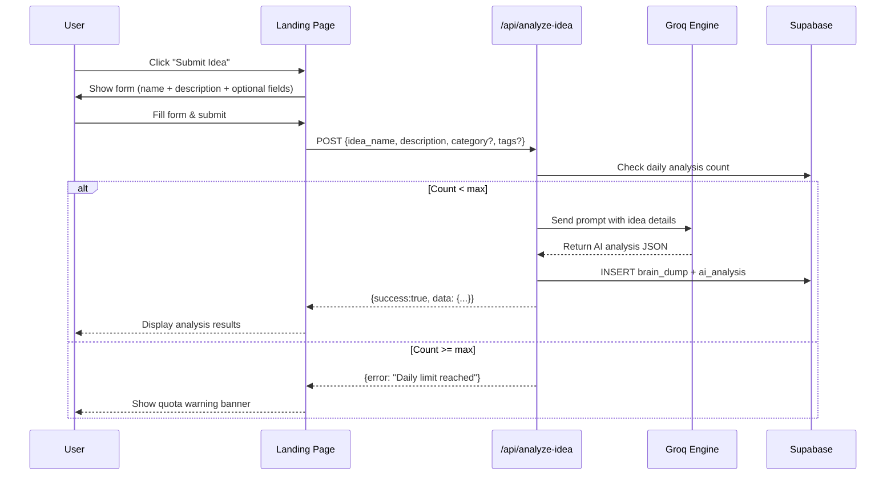
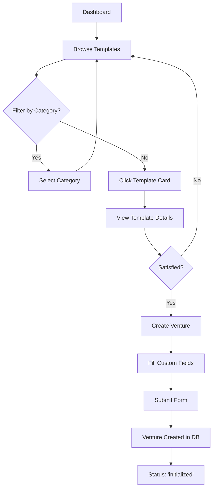
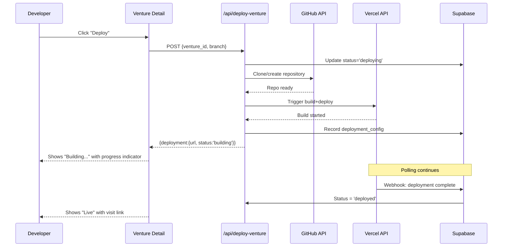
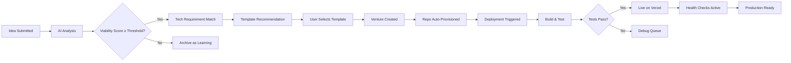
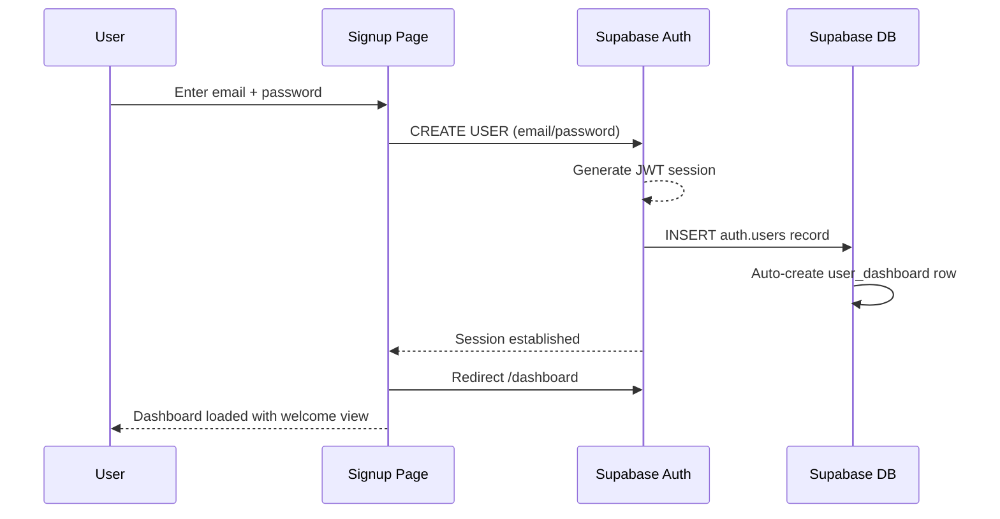

# User Stories & Flows

> **Last updated:** 2026-05-14 | **Version:** v1.0.0
> Cross-links: See [01_PRODUCT_REQUIREMENTS.md](./01_PRODUCT_REQUIREMENTS.md) for product context | [03_SYSTEM_ARCHITECTURE.md](./03_SYSTEM_ARCHITECTURE.md) for technical implementation | [02_USER_STORIES_FLOWS.md] ← this file

---

## Table of Contents

- [User Personas](#user-personas)
- [Persona 1: Entrepreneur / Idea Generator](#persona-1-entrepreneur--idea-generator)
- [Persona 2: Developer / Builder](#persona-2-developer--builder)
- [Persona 3: Admin / Operator](#persona-3-admin--operator)
- [Cross-Cutting Flows](#cross-cutting-flows)
- [Edge Case & Error Handling Flows](#edge-case--error-handling-flows)
- [Decision Matrices](#decision-matrices)

---

## User Personas

### Persona 1: Entrepreneur / Idea Generator (Primary)

| Attribute | Detail |
|-----------|--------|
| **Name** | "Alex" |
| **Role** | Startup founder, solopreneur |
| **Goals** | Discover viable business ideas quickly, validate them with data, launch MVPs fast |
| **Tech Comfort** | Intermediate — can understand tech terms but doesn't want to code manually |
| **Pain Points** | Ideas stay as ideas; too many options; no systematic validation process |
| **Session Duration** | 15–30 minutes per idea cycle |
| **Frequency** | Daily usage expected |

### Persona 2: Developer / Builder (Secondary)

| Attribute | Detail |
|-----------|--------|
| **Name** | "Jordan" |
| **Role** | Full-stack developer, indie hacker |
| **Goals** | Quickly scaffold projects, automate boilerplate, deploy to production rapidly |
| **Tech Comfort** | Advanced — comfortable with APIs, deployments, CLI tools |
| **Pain Points** | Spent too much time on setup instead of building features; repetitive scaffolding |
| **Session Duration** | 30–120 minutes per project |
| **Frequency** | Weekly or per-project basis |

### Persona 3: Admin / Operator (Tertiary)

| Attribute | Name |
|-----------|--------|
| **Name** | "Casey" |
| **Role** | Platform administrator, DevOps engineer |
| **Goals** | Monitor system health, manage secrets, sync integrations, audit activity |
| **Tech Comfort** | Expert — comfortable with SSH, CLI, database management |
| **Pain Points** | Managing multiple credentials across platforms; monitoring deployment health |
| **Session Duration** | Variable — typically short check-ins (5 min) or deep dives (60+ min) |
| **Frequency** | Multiple times per day |

---

## Persona 1: Entrepreneur / Idea Generator

### Story E1: Submit and Analyze a New Idea

```
As an Entrepreneur,
I want to submit a business idea to the Neural Console,
So that I get an AI-powered viability analysis with scores and recommendations.
```

**Acceptance Criteria:**
- [ ] User inputs `idea_name` (required) and `description` (required)
- [ ] User optionally selects `category` and adds `industry_tags`
- [ ] On submit, the idea is analyzed by Groq LLM
- [ ] Response includes: market potential, complexity, monetization score, SWOT, recommendations
- [ ] Results are saved to `brain_dumps` table
- [ ] If daily limit (default: 5) is exceeded, user sees quota warning

**Flow Diagram:**



**Technical Details:**
- Endpoint: `POST /api/analyze-idea` (see [API_REFERENCE.md](./API_REFERENCE.md))
- Data source table: `brain_dumps` (see [05_DATA_SCHEMA_REGISTRY.md](./05_DATA_SCHEMA_REGISTRY.md))
- AI prompt logic: see [04_AI_ORCHESTRATION_LOGIC.md](./04_AI_ORCHESTRATION_LOGIC.md)
- Rate limit: `NEXT_PUBLIC_MAX_ANALYSES_PER_DAY` env var (default: 5)

---

### Story E2: View Analysis History

```
As an Entrepreneur,
I want to browse my past idea analyses,
So that I can compare ideas and pick the best one to pursue.
```

**Acceptance Criteria:**
- [ ] All of user's `brain_dumps` listed in reverse chronological order
- [ ] Each item shows: name, date, viability_score, category, deployment_suitability
- [ ] Filtering by category and sorting by score/date
- [ ] Clicking an item opens a detailed view with full AI analysis
- [ ] Delete button available (with confirmation)

---

### Story E3: Launch a Venture from Template

```
As an Entrepreneur,
I want to select a venture template and customize it for my idea,
So that I can start building quickly without starting from scratch.
```

**Acceptance Criteria:**
- [ ] Browse all templates in Vault
- [ ] Each template card shows: name, category, tech stack preview, feature badges
- [ ] Filter templates by category, popularity
- [ ] Selecting a template fills the venture creation form with preset values
- [ ] User can override any preset before creating
- [ ] Created venture links back to selected template (template_id stored)

**Flow Diagram:**



---

### Story E4: Track Venture Progress

```
As an Entrepreneur,
I want to track the progress of my deployed ventures,
So that I know when each milestone is reached.
```

**Acceptance Criteria:**
- [ ] Ventures displayed in a grid/list on dashboard
- [ ] Each venture shows status badge: initialized → deploying → deployed → active
- [ ] Clicking a venture reveals detailed progress panel with stages:
  - Repository created ✓/○/✗
  - Deployment triggered ✓/○/✗
  - Health check passed ✓/○/✗
- [ ] Real-time updates via polling (every 30 seconds)

---

### Story E5: Review Dashboard Analytics

```
As an Entrepreneur,
I want to see platform statistics on my dashboard,
So that I understand how popular and successful ventures are.
```

**Acceptance Criteria:**
- [ ] Stats cards display: Total Users, Ventures Created, Templates Available, Analyses Made
- [ ] Trend indicators (up/down arrow) showing change over time
- [ ] Activity chart showing submissions and deployments over last 30 days
- [ ] Quick-access buttons linking to each major section

**Data Source:** `GET /api/dashboard/stats` aggregates counts from all tables.

---

## Persona 2: Developer / Builder

### Story D1: Create a Custom Venture

```
As a Developer,
I want to create a completely custom venture from scratch,
So that I have full control over the project structure and technology choices.
```

**Acceptance Criteria:**
- [ ] Venture creation form accepts: name, description, tech stack selection, feature checklist
- [ ] Tech stack builder lets user toggle technologies: Next.js, Supabase, Stripe, TailwindCSS, etc.
- [ ] Feature checklist includes: Authentication, Payments, Admin Panel, API Routes, File Upload
- [ ] Generated venture gets auto-configured repository skeleton

---

### Story D2: Deploy to Vercel

```
As a Developer,
I want to trigger automatic deployment of my venture to Vercel,
So that it becomes live on a public URL instantly.
```

**Acceptance Criteria:**
- [ ] Click "Deploy" button on venture detail view
- [ ] System triggers `POST /api/deploy-venture` with venture_id and branch
- [ ] Deployment state machine advances: `initialized` → `deploying` → `deployed`
- [ ] Success response returns: deployment ID, preview URL, status
- [ ] Failure returns clear error message with troubleshooting steps

**Flow Diagram:**



---

### Story D3: Manage GitHub Integration

```
As a Developer,
I want to configure my GitHub token once and reuse it for all ventures,
So that I don't need to re-enter credentials for every project.
```

**Acceptance Criteria:**
- [ ] Admin-only endpoint `POST /api/admin/sync-secrets` stores encrypted tokens
- [ ] Token encrypted using AES-256 with configurable encryption key
- [ ] Stored in `system_secrets` table with field masking (only prefix visible)
- [ ] Octokit client uses stored token for repository operations
- [ ] Rotation procedure documented in [14_API_KEY_MANAGEMENT.md](./14_API_KEY_MANAGEMENT.md)

---

## Persona 3: Admin / Operator

### Story A1: Sync Secrets and Integrations

```
As an Admin,
I want to securely store and manage API keys for external services,
So that the platform can interact with GitHub and Vercel automatically.
```

**Acceptance Criteria:**
- [ ] Admin login required to access secret management
- [ ] Supports storing GitHub personal access tokens and Vercel API tokens
- [ ] Tokens encrypted at rest using configurable ENCRYPTION_KEY env variable
- [ ] Sync operation logs entry in execution log ([13_EXECUTION_LOG_AUDIT.md](./13_EXECUTION_LOG_AUDIT.md))
- [ ] Audit trail records: who synced, when, what was modified

---

### Story A2: Monitor System Health

```
As an Admin,
I want to monitor system-wide health through centralized dashboards,
So that I can detect and respond to issues proactively.
```

**Acceptance Criteria:**
- [ ] Dashboard stats aggregated in real-time (`GET /api/dashboard/stats`)
- [ ] Monitoring of Groq API latency and error rates
- [ ] Supabase connection health check (periodic ping)
- [ ] Alert thresholds configurable per service
- [ ] Incident tracking via [17_ERROR_FORENSICS_LOG.md](./17_ERROR_FORENSICS_LOG.md)

---

### Story A3: Access Neural Console

```
As an Admin,
I want to access the Neural Console for advanced monitoring and control,
So that I can oversee AI behavior and system-level operations.
```

**Acceptance Criteria:**
- [ ] Protected route accessible only to admin users
- [ ] Displays: current AI model version, average response times, token usage estimates
- [ ] Shows queued vs. completed analysis jobs
- [ ] Admin controls: rate limit adjustment, model selection override, emergency stop button

---

## Cross-Cutting Flows

### Flow F1: Complete Idea-to-Venture Lifecycle



### Flow F2: User Registration & Onboarding



---

## Edge Case & Error Handling Flows

### Edge E1: Analysis Fails Midway

```
When: Groq API returns an error OR times out
Then:   Show user-friendly error ("Analysis temporarily unavailable")
        Log error with correlation ID (see Execution Log format)
        Increment failure counter for rate limiting
        Offer retry after cooldown period
```

### Edge E2: Deployment Timeout

```
When: Vercel takes > 10 minutes to build
Then:   Status transitions to 'failed' with reason
        Notify user via on-page banner
        Create incident entry for [ERROR_FORENSICS_LOG](./17_ERROR_FORENSICS_LOG.md)
        Suggest manual intervention path
```

### Edge E3: Secret Sync Fails

```
When: Database is unreachable during secret update
Then:   Transaction rolls back atomically
        Error logged with full context
        Admin receives alert (future: email/Slack webhook)
        No partial writes — all-or-nothing guarantee
```

### Edge E4: Daily Analysis Limit Exceeded

```
When: User exceeds NEXT_PUBLIC_MAX_ANALYSES_PER_DAY
Then:   Banner shown: "Daily limit reached. Try again tomorrow."
        Limit reset at midnight UTC
        Configurable by admin via environment variable
        Future: Paid tier could increase limits
```

---

## Decision Matrices

### Matrix M1: Template Selection Logic (by Category)

| Idea Category | Recommended Template(s) | Key Differentiators |
|--------------|-------------------------|--------------------|
| **web-app** | SaaS Starter, Landing Page | React framework choice, auth layer |
| **saas** | SaaS Starter + Stripe Addon | Built-in payments, multi-tenant support |
| **ecommerce** | E-commerce Boilerplate | Product catalog, cart, checkout flow |
| **content** | Blog / CMS Template | Markdown support, SEO optimized, RSS feeds |
| **ai-tool** | AI Tool Wrapper | API gateway pattern, queue system, usage metering |
| **marketplace** | Marketplace Skeleton | Two-sided marketplace, escrow pattern |

### Matrix M2: Complexity × Monetization Prioritization

| Complexity \ Monetization | Low (< $1K/mo potential) | Medium ($1K-$10K) | High ($10K+) |
|--------------------------|--------------------------|--------------------|--------------|
| **Low** (fewer features) | Quick win — prioritize | Consider | Evaluate further |
| **Medium** | Good side project | Primary target | Strategic investment |
| **High** (complex) | Skip unless passionate | Validate thoroughly | Major commitment |

### Matrix M3: Technology Stack Recommendations

| Use Case | Primary Stack | Optional Add-ons |
|----------|--------------|-----------------|
| Full-stack web app | Next.js + Supabase | Stripe, RLS policies |
| Landing/marketing | Next.js + TailwindCSS | Vercel analytics |
| API-first service | Next.js API routes | Supabase edge functions |
| AI-integrated tool | Next.js + Groq SDK | Redis queue, OpenRouter |
| E-commerce | Next.js + Supabase | Stripe Connect, Vercel Blob |
| Dashboard/analytics | Next.js + Supabase | Chart libraries, real-time |
