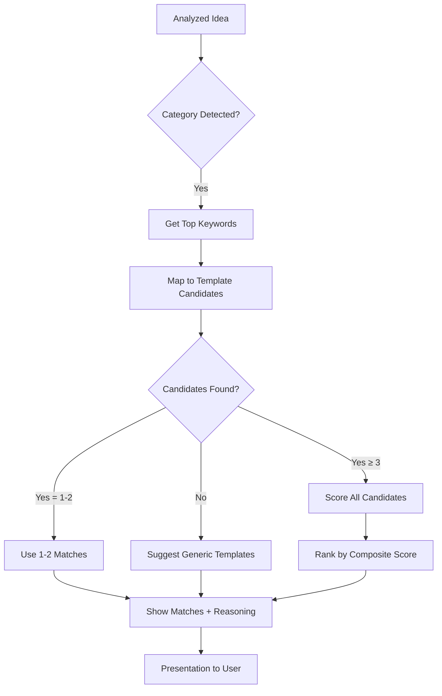
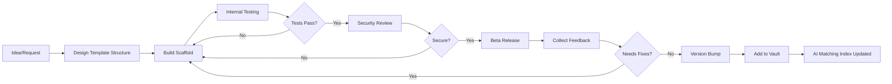

# Vault Template Specs

> Comprehensive venture blueprint specifications, parameter schemas, matching logic, and versioning strategy.
> **Last updated:** 2026-05-14 | **Version:** v1.0.0
> Cross-links: See [04_AI_ORCHESTRATION_LOGIC.md](./04_AI_ORCHESTRATION_LOGIC.md) for template selection engine | [05_DATA_SCHEMA_REGISTRY.md](./05_DATA_SCHEMA_REGISTRY.md) for template table schema | [API_REFERENCE.md](./API_REFERENCE.md) for template API endpoints

---

## Table of Contents

- [Template Overview](#template-overview)
- [All Venture Templates](#all-venture-templates)
- [Template Parameterization Schema](#template-parameterization-schema)
- [Template-to-Idea Matching Logic](#template-to-idea-matching-logic)
- [Template Versioning Strategy](#template-versioning-strategy)
- [Template Creation Workflow](#template-creation-workflow)
- [Template Testing & Validation](#template-testing--validation)
- [Maintenance & Updates](#maintenance--updates)

---

## Template Overview

Boss Factory's template vault contains pre-built venture blueprints — fully-configured project skeletons ready for immediate customization and deployment. Each template defines a complete application architecture including file structure, tech stack, features, configurations, and environment requirements.

### Core Principles

| Principle | Description |
|-----------|-------------|
| **Zero boilerplate** | Templates eliminate all setup; developers start building features immediately |
| **Production-ready** | Every template includes auth, database integration, error handling, and basic monitoring |
| **Convention over configuration** | Decisions made upfront reduce choice paralysis and speed development |
| **Composable** | Templates can be extended or combined via addon modules |
| **Versioned** | Breaking changes increment major version; patches are backward-compatible |

### Template Anatomy

Every venture template follows this structural pattern:

```
template-name/
├── package.json              # Dependencies (pre-configured)
├── tsconfig.json             # TypeScript config
├── tailwind.config.ts        # Theme configuration
├── next.config.js            # Next.js config with rewrites
├── src/
│   ├── app/                  # App Router pages
│   │   ├── layout.tsx        # Root layout with providers
│   │   ├── page.tsx          # Landing/home page
│   │   └── globals.css       # Global styles + Tailwind import
│   ├── components/           # Reusable UI components
│   │   ├── ui/               # Base UI primitives (buttons, inputs, cards)
│   │   ├── layout/           # Layout components (header, sidebar, footer)
│   │   └── venture/          # Venture-specific components
│   ├── lib/                  # Utilities and client libraries
│   │   ├── supabase/         # Supabase client instances
│   │   └── utils.ts          # Shared utilities (cn(), formatters)
│   ├── hooks/                # Custom React hooks
│   └── types/                # TypeScript type definitions
├── supabase/                 # Supabase migrations
│   └── migrations/           # Initial schema
├── public/                   # Static assets
│   └── robots.txt
├── .env.example              # Environment variables template
├── .gitignore
└── README.md                 # Template-specific documentation
```

---

## All Venture Templates

### T1: SaaS Starter 🏗️

| Attribute | Value |
|-----------|-------|
| **Category** | saas |
| **Name** | SaaS Starter |
| **Description** | Full-stack SaaS application with subscription billing, user management, and admin dashboard |
| **Tech Stack** | Next.js 15, Supabase, Stripe, TailwindCSS, Lucide icons, Zod validation |
| **Features** | [Authentication, Payments/Subscriptions, Admin Dashboard, User Profile, API Routes, Email Notifications, RBAC, Audit Logging] |
| **Repo URL** | `https://github.com/boss-factory/templates/tree/main/saas-starter` |
| **Demo URL** | `https://saas-starter-demo.vercel.app` |
| **Version** | 1.0.0 |
| **Est. Deploy Time** | 15 minutes |
| **File Structure** | `[src/app/, src/components/ui/, src/components/layout/, src/components/venture/, src/lib/supabase/, src/hooks/, src/types/, supabase/migrations/]` |
| **Complexity** | Medium-High |
| **Best For** | Subscription-based web applications, membership platforms, multi-tenant SaaS products |

#### Required Environment Variables

```ini
NEXT_PUBLIC_SUPABASE_URL=your-supabase-url
SUPABASE_ANON_KEY=your-anon-key
STRIPE_SECRET_KEY=sk_test_xxx
STRIPE_WEBHOOK_SECRET=whsec_xxx
NEXT_PUBLIC_APP_URL=http://localhost:3000
```

#### Database Tables Created

| Table | Purpose | Columns |
|-------|---------|---------|
| `profiles` | User profiles extending auth.users | id, username, avatar_url, tier, created_at |
| `subscriptions` | Stripe subscription mapping | id, user_id, stripe_sub_id, status, plan_id, ends_at |
| `audit_logs` | System audit trail | id, user_id, action, target, timestamp |

---

### T2: Landing Page Pro 🚀

| Attribute | Value |
|-----------|-------|
| **Category** | marketing |
| **Name** | Landing Page Pro |
| **Description** | High-conversion landing page with hero section, features grid, testimonials, pricing, and CTA |
| **Tech Stack** | Next.js 15, TailwindCSS, Framer Motion animations |
| **Features** | [Responsive Design, Animated Hero, Feature Cards, Testimonial Carousel, Pricing Toggle (Monthly/Annual), Contact Form, SEO Optimized] |
| **Repo URL** | `https://github.com/boss-factory/templates/tree/main/landing-pro` |
| **Demo URL** | `https://landing-pro-demo.vercel.app` |
| **Version** | 1.1.0 |
| **Est. Deploy Time** | 5 minutes |
| **File Structure** | `[src/app/, src/components/hero/, src/components/features/, src/components/testimonials/, src/components/pricing/, src/components/contact/]` |
| **Complexity** | Low |
| **Best For** | Product launches, startup landing pages, event pages, lead generation |

#### Required Environment Variables

None required — fully static output compatible.

#### Database Tables Created

None — purely static frontend.

---

### T3: E-commerce Boilerplate 🛒

| Attribute | Value |
|-----------|-------|
| **Category** | ecommerce |
| **Name** | E-commerce Boilerplate |
| **Description** | Full e-commerce storefront with product catalog, shopping cart, checkout, and order management |
| **Tech Stack** | Next.js 15, Supabase, Stripe, Vercel Blob Storage, TailwindCSS |
| **Features** | [Product Catalog, Shopping Cart, Stripe Checkout, Order History, Inventory Tracking, Image Uploads, Search & Filter, Wishlist] |
| **Repo URL** | `https://github.com/boss-factory/templates/tree/main/ecommerce-boilerplate` |
| **Demo URL** | `https://ecommerce-demo.vercel.app` |
| **Version** | 1.0.0 |
| **Est. Deploy Time** | 20 minutes |
| **File Structure** | `[src/app/products/, src/app/cart/, src/app/checkout/, src/app/orders/, src/components/product/, src/components/cart/, src/lib/storage/]` |
| **Complexity** | High |
| **Best For** | Online stores, digital goods marketplaces, subscription boxes |

#### Required Environment Variables

```ini
NEXT_PUBLIC_SUPABASE_URL=your-supabase-url
SUPABASE_ANON_KEY=your-anon-key
STRIPE_SECRET_KEY=sk_test_xxx
VERCEL_BLOB_READ_WRITE_TOKEN=vbr_xxx
```

#### Database Tables Created

| Table | Purpose | Columns |
|-------|---------|---------|
| `products` | Product catalog | id, name, description, price, images[], category, inventory_count |
| `orders` | Order records | id, user_id, total, status, shipping_address |
| `order_items` | Line items per order | id, order_id, product_id, quantity, unit_price |

---

### T4: Blog & CMS Template ✍️

| Attribute | Value |
|-----------|-------|
| **Category** | content |
| **Name** | Blog & CMS Template |
| **Description** | Content management system with markdown support, rich text editing, categories, tags, and RSS feeds |
| **Tech Stack** | Next.js 15, Supabase, MDX, TailwindCSS, React Markdown |
| **Features** | [Markdown/Mdx Posts, Categories & Tags, Search, RSS Feed, Author Profiles, Reading Time Estimates, Code Syntax Highlighting, Social Sharing] |
| **Repo URL** | `https://github.com/boss-factory/templates/tree/main/blog-cms` |
| **Demo URL** | `https://blog-cms-demo.vercel.app` |
| **Version** | 1.2.0 |
| **Est. Deploy Time** | 10 minutes |
| **File Structure** | `[src/app/posts/, src/app/admin/, src/components/post/, src/lib/markdown/, src/mdx/]` |
| **Complexity** | Medium |
| **Best For** | Technical blogs, company newsrooms, content-first websites |

#### Required Environment Variables

```ini
NEXT_PUBLIC_SUPABASE_URL=your-supabase-url
SUPABASE_ANON_KEY=your-anon-key
```

#### Database Tables Created

| Table | Purpose | Columns |
|-------|---------|---------|
| `posts` | Published articles | id, title, slug, content_md, excerpt, cover_image, author_id, published_at, status |
| `post_tags` | Post-tag relationships | post_id, tag_id |

---

### T5: AI Tool Wrapper 🤖

| Attribute | Value |
|-----------|-------|
| **Category** | ai-tool |
| **Name** | AI Tool Wrapper |
| **Description** | Production-ready AI application wrapper with API routing, usage metering, queue system, and rate limiting |
| **Tech Stack** | Next.js 15, Groq SDK, Supabase, Redis Queue (Upstash), Zod validation |
| **Features** | [Groq API Gateway, Usage Metering, Request Queue, Rate Limiting, Chat Interface, Output Streaming, Prompt History, Cost Tracking] |
| **Repo URL** | `https://github.com/boss-factory/templates/tree/main/ai-tool-wrapper` |
| **Demo URL** | `https://ai-tool-demo.vercel.app` |
| **Version** | 1.0.0 |
| **Est. Deploy Time** | 25 minutes |
| **File Structure** | `[src/app/chat/, src/app/api/groq/, src/components/chat/, src/lib/queue/, src/lib/metering/]` |
| **Complexity** | High |
| **Best For** | AI-powered SaaS tools, chatbots, content generators, code assistants |

#### Required Environment Variables

```ini
NEXT_PUBLIC_SUPABASE_URL=your-supabase-url
SUPABASE_ANON_KEY=your-anon-key
GROQ_API_KEY=gsk_xxx
UPSTASH_REDIS_REST_URL=https://xxx.upstash.io
UPSTASH_REDIS_REST_TOKEN=xxx
```

#### Database Tables Created

| Table | Purpose | Columns |
|-------|---------|---------|
| `conversations` | Chat history | id, user_id, title, created_at |
| `messages` | Individual messages | id, conversation_id, role, content, tokens_used, model |
| `usage_records` | Token/cost tracking | id, user_id, tokens_in, tokens_out, cost_usd, date |

---

### T6: Marketplace Skeleton 🏪

| Attribute | Value |
|-----------|-------|
| **Category** | marketplace |
| **Name** | Marketplace Skeleton |
| **Description** | Two-sided marketplace with buyer/seller roles, listing management, escrow payments, and dispute resolution |
| **Tech Stack** | Next.js 15, Supabase, Stripe Connect, TailwindCSS, Realtime subscriptions |
| **Features** | [User Roles (Buyer/Seller), Product Listings, Escrow Payments, Messaging System, Reviews & Ratings, Dispute Resolution, Seller Dashboards, Commission Tracking] |
| **Repo URL** | `https://github.com/boss-factory/templates/tree/main/marketplace-skeleton` |
| **Demo URL** | `https://marketplace-demo.vercel.app` |
| **Version** | 1.0.0 |
| **Est. Deploy Time** | 30 minutes |
| **File Structure** | `[src/app/listings/, src/app/dashboard/, src/app/messages/, src/components/marketplace/, src/lib/stripe-connect/]` |
| **Complexity** | Very High |
| **Best For** | Service marketplaces, digital asset marketplaces, peer-to-peer commerce platforms |

#### Required Environment Variables

```ini
NEXT_PUBLIC_SUPABASE_URL=your-supabase-url
SUPABASE_ANON_KEY=your-anon-key
STRIPE_SECRET_KEY=sk_test_xxx
STRIPE_ACCOUNT_ID=acct_xxx
```

#### Database Tables Created

| Table | Purpose | Columns |
|-------|---------|---------|
| `listings` | Products/services for sale | id, seller_id, title, description, price, images[], category, status |
| `transactions` | Payment records | id, buyer_id, seller_id, amount, commission, status, escrow_release_date |
| `messages` | Buyer-seller communication | id, listing_id, sender_id, receiver_id, content, read_at |
| `reviews` | Post-purchase reviews | id, transaction_id, rating, comment, reviewer_id |

---

### T7: Portfolio & Resume 💼

| Attribute | Value |
|-----------|-------|
| **Category** | personal |
| **Name** | Portfolio & Resume |
| **Description** | Professional portfolio website with project showcase, contact form, blog, and resume download |
| **Tech Stack** | Next.js 15, TailwindCSS, Framer Motion, MDX |
| **Features** | [Project Gallery, Bio Section, Skills Visualization, Blog Integration, Downloadable PDF Resume, Contact Form, Theme Switcher] |
| **Repo URL** | `https://github.com/boss-factory/templates/tree/main/portfolio-resume` |
| **Demo URL** | `https://portfolio-demo.vercel.app` |
| **Version** | 1.0.0 |
| **Est. Deploy Time** | 5 minutes |
| **File Structure** | `[src/app/about/, src/app/projects/, src/app/blog/, src/app/contact/]` |
| **Complexity** | Low |
| **Best For** | Freelancers, developers, designers seeking professional online presence |

---

### T8: DevOps Dashboard 🔧

| Attribute | Value |
|-----------|-------|
| **Category** | devops |
| **Name** | DevOps Dashboard |
| **Description** | Infrastructure monitoring dashboard with server metrics, deployment status, and alerting |
| **Tech Stack** | Next.js 15, Supabase Realtime, Chart.js / Recharts, WebSockets |
| **Features** | [Server Health Metrics, Deployment Timeline, Error Monitoring, Uptime Status Pages, Alert Configuration, Resource Usage Charts, Log Viewer] |
| **Repo URL** | `https://github.com/boss-factory/templates/tree/main/devops-dashboard` |
| **Demo URL** | `https://devops-dash-demo.vercel.app` |
| **Version** | 1.0.0 |
| **Est. Deploy Time** | 20 minutes |
| **File Structure** | `[src/app/dashboard/, src/app/metrics/, src/app/alerts/, src/components/charts/, src/lib/realtime/]` |
| **Complexity** | High |
| **Best For** | Teams managing multiple services, SRE teams, internal ops dashboards |

---

## Template Parameterization Schema

Each template accepts injectable parameters at creation time. The system uses these to customize the generated project.

### Core Parameters (All Templates)

| Parameter | Type | Required | Default | Description |
|-----------|------|----------|---------|-------------|
| `name` | string | ✅ Yes | — | Project/venture name (becomes directory and app name) |
| `description` | string | ✅ Yes | — | One-line pitch used in README and meta tags |
| `owner_id` | uuid | ✅ Yes | (from auth) | Current user UUID |
| `color_scheme` | enum | ❌ No | `'neon'` | Primary color theme: `'neon'` \| `'corporate'` \| `'minimal'` |
| `language` | enum | ❌ No | `'en'` | UI language locale for placeholder text and default copy |
| `base_path` | string | ❌ No | `/` | Subpath for deployments (e.g., `/docs`, `/app`) |

### Category-Specific Parameters

#### SaaS Parameters

| Parameter | Type | Required | Default | Description |
|-----------|------|----------|---------|-------------|
| `subscription_model` | enum | ❌ No | `'tiered'` | Pricing model: `'freemium'` \| `'tiered'` \| `'usage'` |
| `include_email_service` | boolean | ❌ No | `true` | Include SendGrid/AWS SES email service setup |
| `multi_tenant` | boolean | ❌ No | `false` | Enable tenant isolation patterns |

#### E-commerce Parameters

| Parameter | Type | Required | Default | Description |
|-----------|------|----------|---------|-------------|
| `currency` | enum | ❌ No | `'usd'` | Primary currency code |
| `shipping_zones` | array | ❌ No | `[]` | Array of shipping zone configs |
| `tax_calculation` | enum | ❌ No | `'manual'` | Tax approach: `'manual'` \| `'stripe'` \| `'avalara'` |

#### AI Tool Parameters

| Parameter | Type | Required | Default | Description |
|-----------|------|----------|---------|-------------|
| `primary_model` | enum | ❌ No | `'llama-3.3-70b-versatile'` | Default Groq model |
| `max_tokens` | integer | ❌ No | `4096` | Maximum output tokens per request |
| `temperature` | float | ❌ No | `0.7` | Model temperature setting |
| `enable_streaming` | boolean | ❌ No | `true` | Enable SSE streaming responses |

### Injection Points

Templates use these injection points where parameters are substituted during scaffold generation:

```handlebars
<!-- Example injection point -->
// src/app/page.tsx
<h1>{{name}}</h1>
<p>{{description}}</p>

<!-- Color scheme injection -->
<!-- @inject-color:primary -->  /* Replaced with actual hex from selected scheme */
```

**Injection Types:**

| Type | Mechanism | Scope |
|------|-----------|-------|
| Text substitution | Direct string replacement in templates | All files |
| Variable injection | Handlebars-style `{{var}}` syntax | Config files, page sources |
| Conditional blocks | `{{#if condition}}...{{/if}}` wrappers | Component inclusion/exclusion |
| Import manipulation | Dynamic import paths based on selected dependencies | Package.json, source files |
| Config merging | Deep merge of config objects (tailwind, next config) | Configuration files |

---

## Template-to-Idea Matching Logic

The AI orchestrator (see [04_AI_ORCHESTRATION_LOGIC.md](./04_AI_ORCHESTRATION_LOGIC.md)) selects appropriate templates based on idea analysis results. This section details the matching algorithm.

### Scoring Algorithm

For each template T and analyzed idea I, calculate a match score:

```python
match_score(T, I) = w₁ * category_fit(T, I) 
                  + w₂ * tech_compatibility(T, I)
                  + w₃ * complexity_alignment(I)
                  + w₄ * monetization_fit(T, I)
                  + w₅ * popularity_factor(T)

where:
  w₁ = 0.30  (category alignment is most important)
  w₂ = 0.25  (tech stack compatibility)
  w₃ = 0.15  (matches developer skill level)
  w₄ = 0.15  (supports the monetization model)
  w₅ = 0.15  (based on template popularity/use count)
```

### Matching Steps

1. **Category Extraction**: Parse idea_analysis.trending_keywords and idea_analysis.category
2. **Keyword-to-Template Mapping**: Match extracted keywords against template.feature arrays
3. **Tech Compatibility Check**: Verify user has necessary tokens/keys for template dependencies
4. **Complexity Filter**: Exclude templates too complex (>user_experience_level) or too simple (<needed_features)
5. **Monetization Overlay**: Prioritize templates supporting the identified revenue model
6. **Rank & Score**: Calculate final scores and rank top 3 matches
7. **Present Results**: Return ranked list with confidence percentages

### Keyword Mapping Table

| Idea Keyword | Mapped Template(s) | Confidence |
|-------------|-------------------|------------|
| "shop", "store", "buy" | T3 E-commerce, T6 Marketplace | 95% |
| "saas", "subscription", "billing" | T1 SaaS Starter | 90% |
| "blog", "articles", "news" | T4 Blog & CMS | 95% |
| "AI", "chat", "LLM", "prompt" | T5 AI Tool Wrapper | 90% |
| "portfolio", "resume", "hire" | T7 Portfolio & Resume | 95% |
| "dashboard", "monitoring", "ops" | T8 DevOps Dashboard | 85% |
| "landing", "page", "marketing" | T2 Landing Page Pro | 95% |
| "marketplace", "platform", "connect" | T6 Marketplace | 80% |
| "analytics", "tracking", "data" | T8 DevOps Dashboard, T1 SaaS | 70% |

### Decision Flowchart



---

## Template Versioning Strategy

### Semantic Versioning

Each template follows strict semver: `MAJOR.MINOR.PATCH`

| Version Part | Change Type | Example | Backward Compatible? |
|-------------|-------------|---------|---------------------|
| MAJOR | Breaking change (schema migration required) | v1.x → v2.0 | ❌ No |
| MINOR | New feature added (backward compatible) | v1.0 → v1.1 | ✅ Yes |
| PATCH | Bug fix, security update | v1.0.0 → v1.0.1 | ✅ Yes |

### Migration Policy

```
Current → Target    Action Required
─────────────────────────────────────
v1.x → v1.y (same major)    Auto-upgrade, data preserved
v1.x → v2.x                 Manual review required, migration script provided
Any → latest (PATCH only)   Automatic, zero downtime
```

### Deprecation Schedule

```
Week 0:     Template marked deprecated in documentation
Week 4:     Deprecated templates removed from default recommendations
Week 8:     Deprecated templates moved to archive branch
Week 12:    Deprecated templates purged from repository
```

### Version Registry

| Template ID | Current Version | Latest Patch | Deprecation Status | Notes |
|------------|----------------|--------------|-------------------|-------|
| `t1_saas_starter` | 1.0.0 | 1.0.0 | Active | Stable launch version |
| `t2_landing_pro` | 1.1.0 | 1.1.0 | Active | Minor release |
| `t3_ecommerce` | 1.0.0 | 1.0.0 | Active | Launch version |
| `t4_blog_cms` | 1.2.0 | 1.2.0 | Active | Recent patch included |
| `t5_ai_wrapper` | 1.0.0 | 1.0.0 | Active | Launch version |
| `t6_marketplace` | 1.0.0 | 1.0.0 | Active | Complex, stable |
| `t7_portfolio` | 1.0.0 | 1.0.0 | Active | Launch version |
| `t8_devops_dash` | 1.0.0 | 1.0.0 | Active | Launch version |

---

## Template Creation Workflow

New templates follow this lifecycle before being available in the vault:



### Quality Gates

| Gate | Checklist |
|------|-----------|
| **Design** | All core features implemented, consistent design system usage, responsive on all breakpoints |
| **Testing** | Build passes (`next build`), lint clean, no console errors |
| **Security** | No hardcoded secrets, env vars properly scoped, RLS policies in place |
| **Documentation** | README updated, env vars documented, known limitations noted |
| **Performance** | Lighthouse score > 80 on all metrics |

---

## Template Testing & Validation

### Automated Checks

Run before any template goes live:

```bash
# 1. Build validation
cd template-directory && bun run build

# 2. Lint check
bun run lint

# 3. Type checking
bun run typecheck

# 4. Preview deploy to staging
npx vercel --target=staging

# 5. Run contract test suite
bun test tests/contract/template-validator.test.ts
```

### Manual Verification

- [ ] Navigation works across all pages
- [ ] Forms submit correctly with validation
- [ ] Auth flow works end-to-end (signup → login → protected route)
- [ ] Database migrations apply without errors
- [ ] Responsive design verified on mobile, tablet, desktop
- [ ] Dark mode displays correctly (all neon colors visible)

---

## Maintenance & Updates

### Scheduled Tasks

| Frequency | Task | Owner |
|-----------|------|-------|
| Weekly | Security dependency updates (`bun upgrade`) | Admin |
| Monthly | Template review — deprecation candidates, new feature requests | Maintainers |
| Quarterly | Major version planning, breaking change review | Team |
| On-demand | Emergency security patches | Any contributor |

### Issue Triage Priority

| Severity | Response Time | Examples |
|----------|--------------|----------|
| **P0 - Critical** | 24 hours | Template fails to build, security vulnerability, data loss risk |
| **P1 - High** | 72 hours | Missing core feature, broken auth, migration failures |
| **P2 - Medium** | 1 week | Visual bugs, performance issues, missing edge case handling |
| **P3 - Low** | Sprint planning | Cosmetic improvements, documentation gaps, nice-to-have features |
